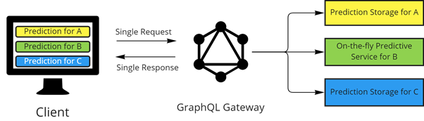

# prediction gateway

해당 프로젝트는 예측 데이터에 대한 멀티사이트 데이터 패치 책임을 Client 애플리케이션으로부터 위임받아 수행하는 GraphQL Server입니다.



## 1. 주요 기능
1. Client의 GraphQL Query 요청에 따라 필요한 예측 데이터를 해당 데이터가 존재하는 위치로부터 패치하여 종합된 결과를 반환합니다.
2. 데이터 패치 정보는 중앙집중싱 Feature Metadata store(개발중)에 있으며 해당 프로젝트 Server에 캐시됩니다.
3. 향후 Subscription 기능을 바탕으로 비동기적 실시간 전송으로 전환할 계획이다.
## 2. 시작하기 전 준비사항
이 프로젝트는 node.js 엔진 버전 16.15에서 개발되었습니다.<br>
- node.js
- npm

## 3. GraphQL Schema
서비스 정의가 담긴 Schema 정보는 다음과 같으며 http://{prediction-gateway server ip}:4000 의 Apollo Studio에 접속하여 Schema Introspection 및 Test Query를 수행할 수 있습니다.
### 3.1 Type Schema

#### 3.1.1 scalar GraphQLDateTime (from 'graphql-custom-type')
``` graphql
# It is from 'graphql-custom-type' node package
scalar GraphQLDateTime
```
#### 3.1.2 enum DBscheme
``` graphql
enum DBScheme {
    INFLUX
    ONTHEFLY
    MYSQL
  }
```
#### 3.1.3 interface ConnectionInfo
``` graphql
interface ConnectionInfo{
    scheme: DBScheme!
    host: String!
    port: String!
  }
```
#### 3.1.4 type InfluxConn implements ConnectionInfo
``` graphql
type InfluxConn implements ConnectionInfo{
      scheme: DBScheme!
      host: String!
      port: String!
      user: String!
      passwd: String!
  }
```
#### 3.1.5 type DB
``` graphql
type DB{
    name: ID!
    conn: ConnectionInfo
    tables: [Table]!    
  }
```
#### 3.1.6 type Table
``` graphql
type Table{
    name: String!
    features: [Feature]!
    db: DB!
  }
```
#### 3.1.7 type Feature
``` graphql
type Feature{
    name: String!
    table: Table!
  }
```
#### 3.1.8 type Prediction
``` graphql
type Prediction{
      timestamps: [GraphQLDateTime]!
      values: [Float]!
  }
```
#### 3.1.9 type FeaturePrediction
``` graphql
type FeaturePrediction{
      """
      If no fetched predictions exists, start will be null
      """
      start: GraphQLDateTime
      """
      If no fetched predictions exists, end will be null
      """
      end: GraphQLDateTime
      length: Int!
      feature: Feature!
      prediction: Prediction!
  }
```
#### 3.1.10 input PredictionInput
``` graphql
input PredictionInput{
      dbName: String!
      tableName: String!
      featureName: String!
      start: GraphQLDateTime!
      end: GraphQLDateTime
      reqNum: Int
  }
```
### 3.2 Query schema
#### 3.2.1 type Query
``` graphql
type Query{
      featurePrediction(input: PredictionInput!): FeaturePrediction!
  }
```
## 3. 시작하기
### 3.1 프로젝트 클론
다음과 같이 프로젝트를 받아주세요.
``` sh
$ mkdir {YOUR_DESIRED_PATH} && cd {YOUR_DESIRED_PATH}
$ git clone https://github.com/Sparkhu/prediction-gateway.git
$ cd prediction-gateway
```
### 3.2 config 파일 입력
서비스가 동작하기 위해 `config/databases` 파일에 Prediction 정보가 담긴 Database 정보를 입력해주세요. (현재 influxdb만 지원, 향후 RDB, on-the-fly서비스 추가 예정)

### 3.3 npm package 설치
``` sh
$ npm install
```

### 3.4 서비스 실행
``` sh
$ npm start
```

### 3.5 (Optional) Apollo Studio 접속 및 Schema Introspection
서버가 정상적으로 실행되었다면 http://{Server_ip}:4000 에 접속하여 GUI기반 Introspection 및 Test Query를 진행할 수 있습니다.

## 4. 라이센스
This project is licensed under the terms of the [MIT license](https://opensource.org/licenses/MIT).
